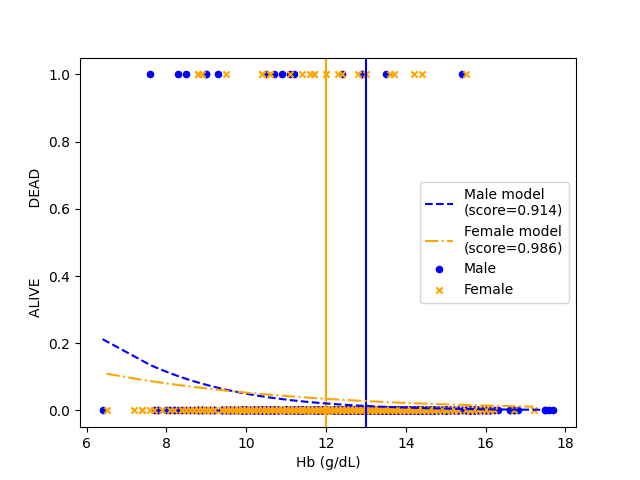

# Marine ows me a beer

## Exact Fisher Test

There are 2252 patients

There are 1445 patients with available Hb data

There are 1239 patients that are still alive from ALIVE.J30

There are 7 patients that are dead from ALIVE.J30

We found an addition of 32 dead patients from their date information

We found an addition of 0 living patients from their date information

There are 167 patients with no death information at all. Ignoring them.

Total : 1239 alive and 39 dead

There are 544 anaemic patients

|             | Alive     | Dead |
|-------------|-----------|------|
| Anaemic     | 517       | 27   |
| Not Anaemic | 722       | 12   |

Fischer Exact Test :

One tail P-value: 0.3182517697753155.

Two-tail P-value 0.0008215042880302882

## Logistic regression

### Death vs Hb

Vertical lines are the limit under which a male (13 g/dL) or a female (12 g/dL) patient is considered anaemic.
